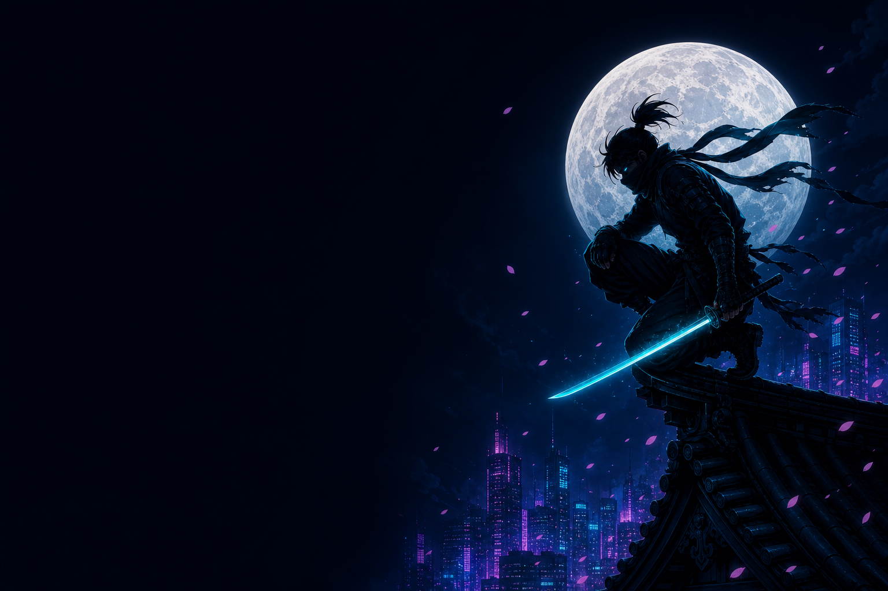
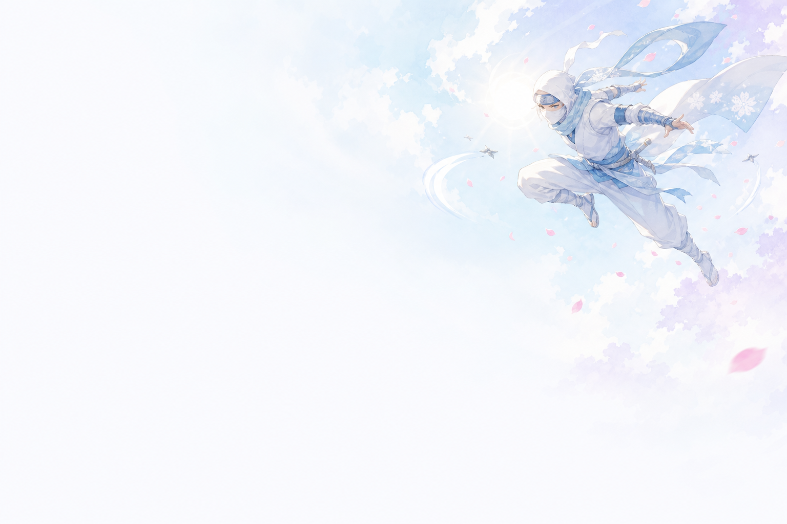
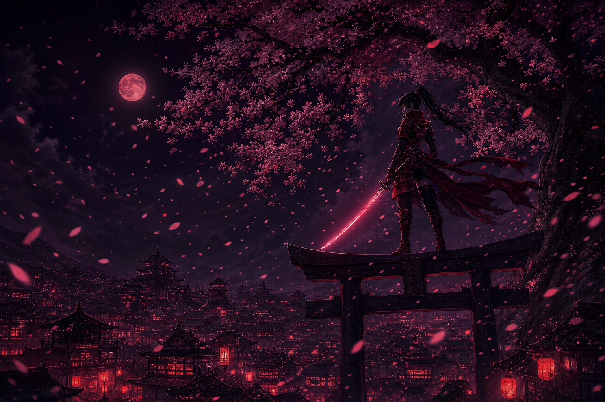
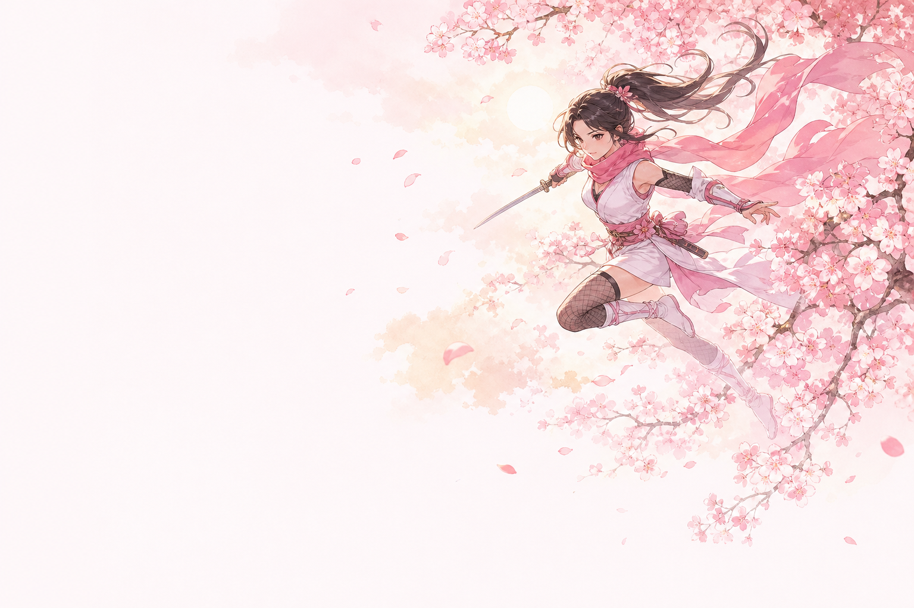
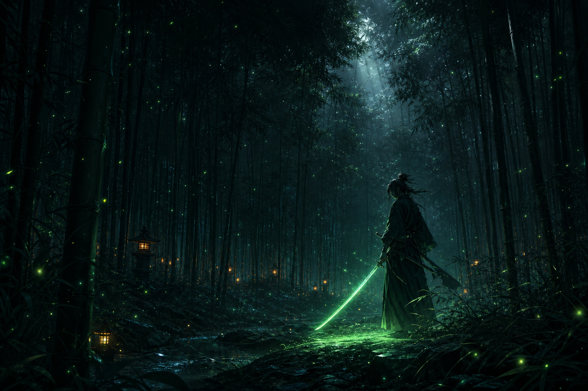
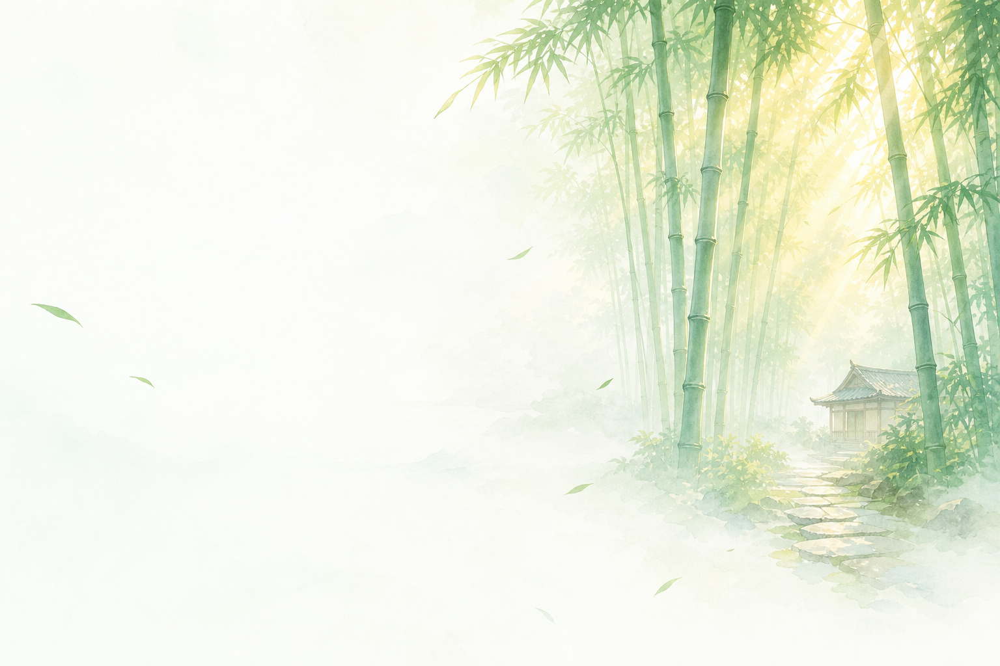
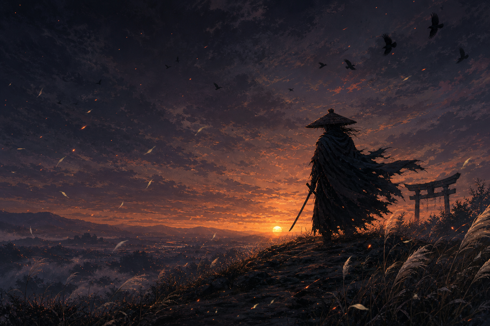
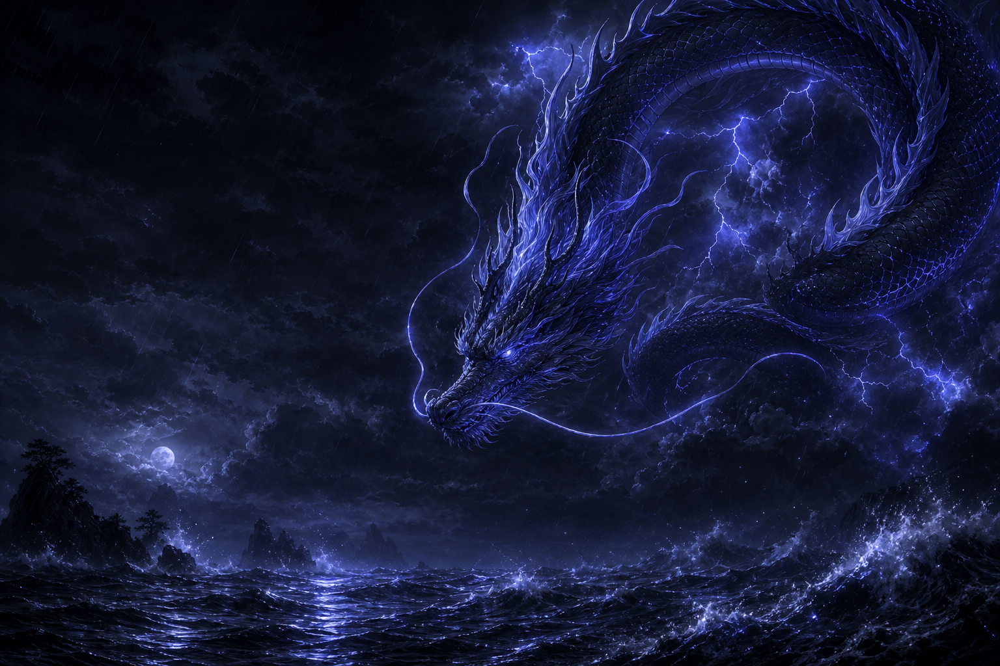
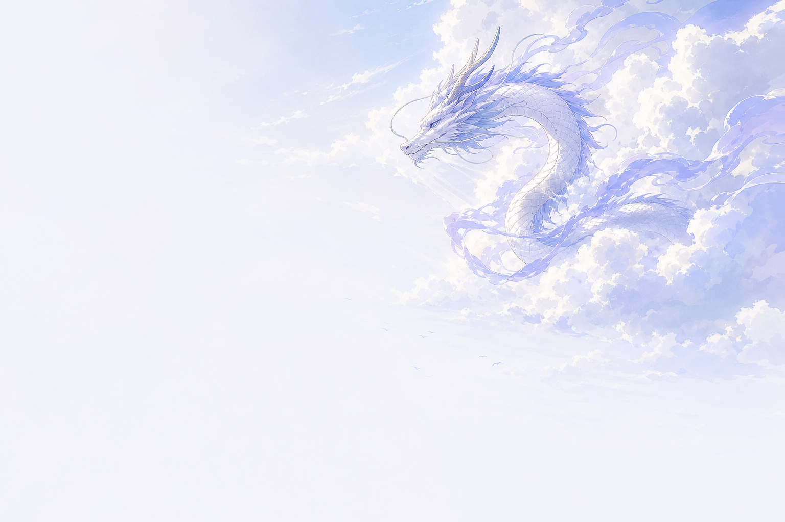

# dsh-skin-nebula

English | [中文](README.zh.md)

Anime skin pack for the [DeepSeek Harness](https://github.com/deepseek-ai/deepseek-harness) Web UI — translucent surfaces over AI-generated HD artwork, a shirt-icon switcher at the top right to pick between five built-in skins, and an adjustable transparency slider.

## Skins

| Skin | Accent | Dark artwork | Light artwork |
| --- | --- | --- | --- |
| Ninja | neon cyan | moonlit ninja over a cyberpunk skyline | white-clad ninja in a bright sky |
| Sakura | rose | kunoichi on a torii gate under a blood moon | sakura kunoichi in a pastel sky |
| Bamboo | emerald | night bamboo grove, emerald blade and fireflies | misty morning bamboo with sunbeams |
| Ronin | amber | wandering ronin against the last ember of dusk | golden-hour countryside |
| Ryujin | indigo | eastern dragon coiling through a night storm | white dragon gliding among sunlit clouds |

The dropdown also has a transparency slider (0-100%, default 50%): higher = more artwork showing through; menus and popovers keep a readability floor. Skin choice and transparency persist in `localStorage` per browser. Both color schemes (light/dark) are covered by every skin; the backdrop follows `body[data-ds-dark-theme]` automatically.

## Preview

| | Dark | Light |
| --- | --- | --- |
| **Ninja** |  |  |
| **Sakura** |  |  |
| **Bamboo** |  |  |
| **Ronin** |  |  |
| **Ryujin** |  |  |

## Install

From GitHub (recommended):

```sh
dsh plugin --profile web add github:lyq3/dsh-skin-nebula
```

From a local checkout:

```sh
dsh plugin --profile web add file:/path/to/dsh-skin-nebula
```

Ensure `dsh-skin-nebula` is listed in the profile's `dsh.profile.bundles` (the `dsh plugin add` command does this automatically), then restart dsh.

Upgrade: re-run the same `add` command (for `github:` installs, `add github:lyq3/dsh-skin-nebula` pulls the latest `main`), then restart dsh.

Uninstall: `dsh plugin --profile web remove dsh-skin-nebula` and drop the entry from `bundles`.

## How it works

- `index.mjs` — host plugin: registers the `/skin-nebula` prefix route on the dsh webserver to serve artwork from `assets/` (prefix routes must be registered **without** a trailing slash).
- `client/client.js` — browser plugin (`__ModuleLoader__` bundle, hand-written, no bundler):
  - one `ctx.theme.overrideTokens()` layer per active skin, covering the `--dsw-alias-*` semantic tokens **and** the `--dsw-static-neutral-bluish-*` surface scale (the sidebar and some panels read statics directly and would otherwise stay stock gray); every value is a `{ light, dark }` pair so neither scheme bleeds into the other, and re-calling with the same source swaps the whole layer atomically on skin switch;
  - a body-level backdrop stylesheet (no product DOM selectors);
  - the switcher registered in the `shell.overlay` slot, with zh/en dictionaries through the optional `locale` service.
- `assets/` — ten 1536×1024 artworks (dark + light per skin) generated with gpt-image-2.
- `cordis.patch.yml` — inserts the host plugin into the profile's bundle layer.

## Compatibility

Built against `@deepseek-ai/dsh` 0.1.0-rc.6 (Developer Preview) and re-verified on 0.1.0-rc.7 — the `--dsw-alias-*` and `--dsw-static-neutral-bluish-*` token inventories are unchanged between the two. rc releases may still break the `dsh.client` contract or the token inventory; if the skin stops applying after a dsh upgrade, re-check the alias/static token names against `dsh-client-ui-theme`'s style sheets first.

## License

MIT
